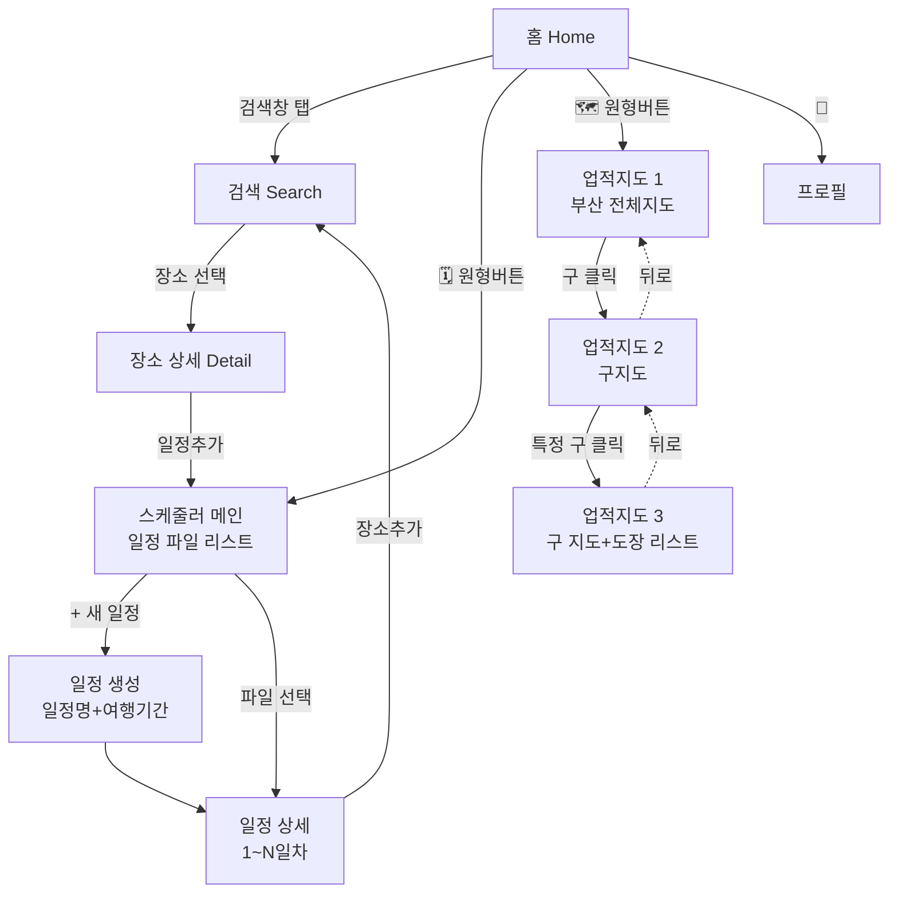
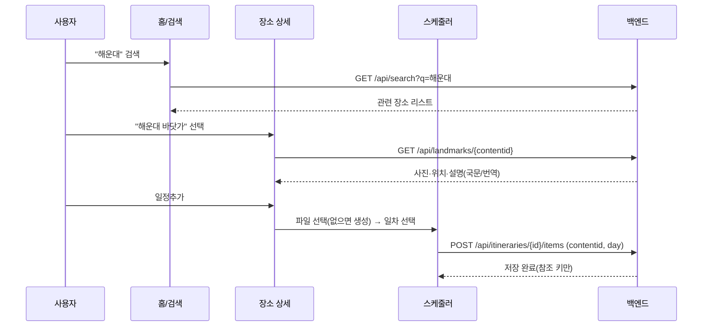
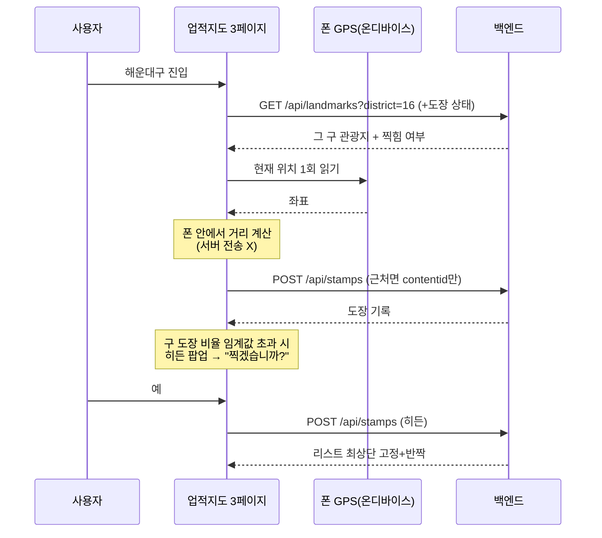

# Mātch K — 화면·흐름 설계문서

> 이 문서는 **바뀐 앱 구조를 처음 보는 사람도 이해하도록** 정리한 상세 설계서입니다.
> 서비스 개요·기술 선택 이유는 `HANDOFF.md`, 환경 세팅은 `TEAM_SETUP.md` 참고.
> (이 문서는 2026-07-31 설계 회의 기준으로 재구성됨 — 이전 구조와 여러 곳이 바뀌었습니다.)

---

## 0. 한 문장 요약

부산 여행 외국인에게 **"당신 언어권엔 아직 안 알려진 로컬 스팟"**을 추천하고(홈), 방문해서 **도장**을 모으고(업적지도), 여행 **일정**을 짜는(스케줄러) 게임형 여행 앱. 세 화면을 마스코트가 잇는다.

핵심 3화면: **홈/검색 · 스케줄러(일정) · 업적지도**. 이 문서는 이 셋의 바뀐 설계를 다룬다.

---

## 1. 네비게이션 한눈에 보기

탭 없는 **스택 네비게이션**, **홈이 허브**. 홈에서 검색·스케줄러·업적지도로 들어갔다 뒤로가기로 돌아온다.



---

## 2. 화면별 상세 설계

### 2-A. 홈 & 검색

**홈 시작 화면** (기존과 동일)
상단 검색창 · 원형버튼 2개(🗓️ 스케줄러 / 🗺️ 업적지도) · 역추천 카드(가로 스크롤) · 마스코트(말풍선).

**검색 화면** — *별도 새 화면으로 분리* (기존: 홈 안 인라인)
- 검색창 아래 **AI(LLM) 추천 검색어/키워드 2~3개**
- 그 아래 **이전 검색어 내역** (X로 삭제 · 구현 어려우면 생략 가능)
- 검색 시 **관련 장소 우선** 노출 (예: "해운대" → 해운대 관련 장소 먼저)

**장소 상세** — 검색 결과에서 장소를 누르면
- **사진 + 위치 + 설명 + 일정추가 버튼**
- ⚠️ **도장 기능 없음** (도장은 업적지도로 이동)
- 데이터: **국문 TourAPI 기준**, 언어권에 없는 내용은 국문 기준 **자동 번역**(Papago 폴백)

**일정추가 버튼** → 스케줄러로 이동
- 일정 파일이 **없으면** → 일정 생성부터(일정명+여행기간)
- 일정 파일이 **있으면** → 파일 선택 → **일차 선택** → 그 일차에 장소 추가

---

### 2-B. 스케줄러 (일정)

**메인** — 일정 파일 리스트
- 파일 없으면 화면 가운데 **+버튼("일정추가")**만
- 파일 있으면 파일 리스트 + 하단 **+버튼**

**새 일정 생성** — **일정명 + 여행기간**만 입력받아 파일 생성. 여행기간 길이만큼 **1일차~N일차** 자동 구성.

**일정 상세** — 일차별 섹션 + 맨 하단 **장소추가 버튼(하나)**
- 장소추가 → 홈 검색 상세로 이동 → 장소 선택 → **일차 선택** → 추가
- **드래그앤드랍**으로 항목을 다른 일차로 이동·순서 변경

> 두 진입 경로(홈발 / 스케줄러발) **모두 "장소 선택 → 일차 선택 → 추가"로 통일**한다.

**저장** — 서버(PostgreSQL), **참조 키만** (콘텐츠는 실시간 호출). 데이터 모델은 §4 참고.
이 데이터는 나중에 **역추천 보강용 데이터베이스**로 쓴다(언어권별 실제 코스·동시등장·동선 패턴·소멸위험 구 담김 비율).

---

### 2-C. 업적지도

**이미지 기반**으로 재구성 (기존 카카오 WebView 제거). **3페이지 + 뒤로가기** 구조.

| 페이지 | 내용 | 상호작용 |
|---|---|---|
| **1. 전체지도** | 부산 한 덩어리 이미지 | 구 영역 클릭 → 2페이지 |
| **2. 구지도** | 줌인되어 부산이 구별로 쪼개진 지도 | 특정 구(예: 해운대구) 클릭 → 3페이지 |
| **3. 구 상세** | 상단 그 구 지도 + 하단 도장 리스트 (네이버지도식 위-지도/아래-리스트) | 도장 찍기, 항목 탭→이름+설명 |

뒤로가기: **3 → 2 → 1**.

**3페이지 도장 리스트**
- 리스트 = 그 구의 **국문 TourAPI 관광지**
- 각 항목에 **도장칸** — 안 찍힌 곳은 빈칸
- 항목을 누르면 **이름 + 설명**(상세)

**도장 찍는 방식** — *포그라운드 원샷 GPS*
- 3페이지 진입 시 GPS를 **딱 한 번** 읽어, 근처 안 찍힌 장소를 자동으로 찍고 애니메이션
- 백그라운드 추적 없음 · 거리 계산은 **폰 안에서** · 위치는 서버 전송 X (위치정보보호법)
- 발표 시엔 `DEMO_MODE`로 GPS 없이 시연 가능

**히든 도장** — *구별 비율 달성 시 화면 내 팝업* (기존: GPS 근처 감지)
- 그 **구의 도장 비율**이 임계값을 넘으면 팝업: "이 장소의 도장을 찍을 수 있습니다. 찍겠습니까?"
- "예" → 도장 획득 → 리스트 **최상단 고정 + 반짝 강조**

---

## 3. 데이터 흐름 (핵심 시나리오)

**시나리오 ① 검색 → 일정에 담기**



**시나리오 ② 업적지도 도장 & 히든**



---

## 4. 데이터 모델

**신규 — 일정(스케줄러)**

```
itineraries        : id, user_id(FK), name(일정명), start_date, end_date, created_at
itinerary_items    : id, itinerary_id(FK), contentid, day_index(1일차=1),
                     sort_order(일차 내 순서 — 드래그앤드랍),
                     lat, lng, sigungu_code, contenttypeid,   ← 참조 키
                     title(표시용 최소 캐시)                    ← 콘텐츠는 실시간
```

- `contentid`는 seed 랜드마크 테이블에 **FK로 묶지 않고 원본 값 그대로** 저장 (검색은 seed에 없는 장소도 잡힘)
- 회원탈퇴 시: 통째 삭제 대신 **user_id만 떼고 익명 집계 보존**하는 방안 고려(추천 신호 유지 + 프라이버시) — *회의 안건*

**기존(요약)** — `users`, `landmarks`(참조만·is_hidden), `stamps`(is_hidden), `District`(sigungu_code·is_declining).
소멸위험 구: **동구=5, 서구=11, 영도구=14** (`config.py DECLINING_SIGUNGU_CODES`).

---

## 5. 신규 / 변경 / 제거 파일 목록

폴더 뼈대(백엔드 models/routers/services, 프론트 screens/components/hooks)는 일관돼서 **같은 형식으로 확장**하면 된다. 가장 큰 신규 작업은 **"일정" 도메인**이 백·프론트 통째로 새로 생기는 것.

### 백엔드 (matchk-api)

| 구분 | 파일 | 내용 |
|---|---|---|
| 🆕 신규 | `models/itinerary.py` | `itineraries` + `itinerary_items` 모델 |
| 🆕 신규 | `routers/itineraries.py` | 일정 CRUD, 장소추가, 일차 이동 |
| 🔧 변경 | `routers/hidden.py` | 발동 기준을 **전체 → 구별 비율**로 |
| 🔧 변경 | `routers/stamps.py` | 구별 진행률은 있음(`?district=`). **구 내 장소별 도장 상태** 응답 추가 |
| 🔧 변경 | `routers/search.py` | **AI(LLM) 추천 검색어/키워드** 생성 추가 |
| 🔧 변경 | `services/recommender.py` | (후속) 일정 데이터 반영 |
| ➕ 마이그레이션 | Alembic | 일정 테이블 추가 |

### 프론트 (matchk-app)

| 구분 | 파일 | 내용 |
|---|---|---|
| 🆕 신규 | `screens/SearchScreen.tsx` | 검색 분리 + AI 추천어 + 이전 검색어 |
| 🆕 신규 | `screens/SchedulerMainScreen.tsx` | 일정 파일 리스트 + 새 일정 |
| 🆕 신규 | `screens/ItineraryDetailScreen.tsx` | 일차별 섹션 + 장소추가 + 드래그앤드랍 |
| 🆕 신규 | 업적지도 3화면 | 전체지도 / 구지도 / 구 상세(지도+리스트) |
| 🆕 신규 | 컴포넌트 | 도장칸·도장 리스트, 일정 카드·일차 섹션 |
| 🔧 변경 | `screens/HomeScreen.tsx` | 인라인 검색 제거(→ SearchScreen) |
| 🔧 변경 | `screens/LandmarkDetailScreen.tsx` | **도장 제거 + 일정추가 버튼** |
| 🔧 변경 | `screens/SchedulerScreen.tsx` | 옛 "검색→연관목록" **폐기 → 일정 관리로 교체** |
| 🔧 변경 | `screens/AchievementMapScreen.tsx` | 카카오 WebView → 이미지 3페이지 |
| 🔧 변경 | `components/HiddenEncounterPopup.tsx` | 트리거를 GPS→구 비율로 (팝업 UI 재활용) |
| 🔧 변경 | `navigation/RootNavigator.tsx` | 새 화면 등록 (**공용 — 단독 PR 먼저**) |
| 🔧 변경 | `api/endpoints.ts` | 일정·AI추천·구별 도장상태 엔드포인트 (**공용**) |
| ❌ 제거 | `map/kakaoMapHtml.ts` | 카카오 지도 폐기 |
| 📦 에셋 | 부산 지도 이미지 | 전체지도 + 구별 지도 (디자인 리소스 필요 — *회의 안건*) |

---

## 6. 팀원 역할 & 작업 순서

역할은 기존 소유권을 유지하되, 바뀐 설계에 맞춰 배정.

| 담당 | 이번 설계에서 맡을 것 |
|---|---|
| **새봄** 역추천 | 역추천 튜닝, (후속) 일정 데이터 반영 |
| **현표** 업적·도장·마스코트 | 업적지도 이미지 3화면, 구별 도장 리스트·상태, 히든 팝업(구 비율 트리거), `hidden.py` 로직 변경 |
| **지현** 상세·검색·번역 | 검색 화면 분리 + AI 추천어(LLM), 상세 도장 제거·일정추가 버튼, 번역 폴백 |
| **다은** 스케줄러 + 깃대장 | 일정 도메인(백엔드 모델·라우터 + 프론트 3화면 + 드래그앤드랍) · **공용 PR 리뷰·머지 관리·CI 게이트** |
| **정현** 인증·언어 + 배포·대표 | 구글 OAuth·언어, Railway 배포·원스토어 등록, 지도 에셋 조달 |

### 작업 순서 (의존성 고려 — 충돌 최소화)

**Phase 0 · 공용 뼈대 먼저** (팀 규칙: 공용 파일은 작은 단독 PR로 먼저 머지)
1. `RootNavigator`에 새 화면 라우트 등록 (다은 조율)
2. `models/itinerary.py` + Alembic 마이그레이션 (다은) — 다른 작업의 전제
3. `api/endpoints.ts`에 신규 엔드포인트 시그니처 추가
4. 카카오 잔재 정리(`kakaoMapHtml.ts` 제거, WebView 의존성 정돈)

**Phase 1 · 각자 화면 병렬**
5. 지현 — SearchScreen 분리 + AI 추천어 백엔드, 상세 도장 제거·일정추가 버튼
6. 다은 — `itineraries.py` CRUD + 스케줄러 3화면 + 드래그앤드랍
7. 현표 — 업적지도 이미지 3화면 + 구별 도장 리스트/상태 + 히든 팝업 + `hidden.py` 구별 전환
8. 정현 — OAuth·언어·배포·원스토어·지도 에셋 / 다은(깃대장) — 공용 PR 리뷰·머지·CI 게이트
9. 새봄 — 역추천 튜닝 계속, 일정 스키마 대비

**Phase 2 · 연결·통합**
10. 홈검색 상세 ↔ 스케줄러 일정추가 **왕복 연결** (지현↔다은 인터페이스 합의: 검색 화면에 "일정 담기 모드" 파라미터 전달)
11. 업적 도장 찍기(포그라운드 원샷 GPS) end-to-end
12. 히든 팝업 end-to-end (구 비율 → 팝업 → 최상단 고정)

**Phase 3 · 마감**
13. 번역 폴백·데모모드·개인정보처리방침·스토어(원스토어) 준비
14. (후속) 역추천에 일정 데이터 반영 — 데이터가 쌓인 뒤 (새봄)

---

## 7. 열린 결정사항 (다음 회의)

- 히든 발동 **구별 비율 수치** (현재 전체 기준 임시값 map 20% / stamp 30% → 구 단위로 재정의)
- **부산 지도 이미지 소스** (전체 + 구별 일러스트)
- 회원탈퇴 시 일정 데이터 **삭제 vs 익명 보존**
- 이전 검색어 내역 구현 여부 (선택)
